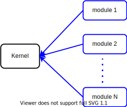
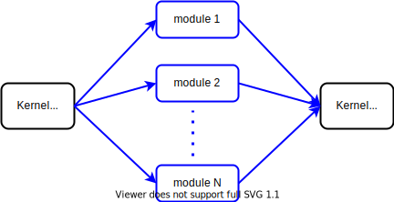

# What is a Gosoline Kernel ?



All Gosoline applications are composed out of a _Kernel_ object to which one or more _modules_ had been added. This is similar to an operating system which has a kernel permanently running, offering a default core functionality, and allowing you to configure additional modules for extra features.  

A Gosoline kernel is an object implementing the _kernel.Kernel_ interface:

[embedmd]:# (../../pkg/kernel/kernel.go /type Kernel interface/ /\n}/)
```go
type Kernel interface {
	Add(name string, moduleFactory ModuleFactory, opts ...ModuleOption)
	AddFactory(factory MultiModuleFactory)
	AddMiddleware(middleware Middleware, position Position)
	Running() <-chan struct{}
	Run()
	Stop(reason string)
}
```

This interface provides two types of functionality:
1. Adding a new module, factory, or middleware.
2. Managing the kernel, that is checking to see if it is running, starting, or stopping it.

An important thing to remember, is that you can only add modules to a kernel before it has started running, trying to add modules afterwards is pointless, as they will never run.
## Usage example

[embedmd]:# (../../examples/getting_started/kernel/main.go)
```go
package main

import (
	"context"
	"fmt"

	"github.com/justtrackio/gosoline/pkg/application"
	"github.com/justtrackio/gosoline/pkg/cfg"
	"github.com/justtrackio/gosoline/pkg/kernel"
	"github.com/justtrackio/gosoline/pkg/log"
)

type helloWorldModule struct{}

func (h *helloWorldModule) Run(ctx context.Context) error {
	fmt.Println("Hello World")

	return nil
}

var moduleFactory = func(ctx context.Context, config cfg.Config, logger log.Logger) (kernel.Module, error) {
	return &helloWorldModule{}, nil
}

func main() {
	app := application.New()
	app.Add("hello", moduleFactory)
	app.Run()
}
```

Let us walk through the code above in the same order it will get called at runtime. The starting point of this "Hello World!" application is its _main_ function:

[embedmd]:# (../../examples/getting_started/kernel/main.go /func main/ /\n}/)
```go
func main() {
	app := application.New()
	app.Add("hello", moduleFactory)
	app.Run()
}
```

Inside _main_ a new _kernel.Kernel_ object gets created, by invoking `app := application.New()`. Then a _kernel.ModuleFactory_ factory object gets added to the kernel, under the alias "hello". Lastly, the kernel is started.

In practice, most kernels should be created by invoking `application.Default()`, as the kernel returned by it has several useful predefined configurations.

```
$ go run main.go 
Hello World!
```
Running _main_ will produce the output above. This means that, internally, our kernel starts running, calls the functionality offered by _moduleFactory_, waits until that has finished running, and lastly, stops. 



Indeed, a Gosoline kernel is designed to: start all its modules in different goroutines, roughly at the same time, then wait until all modules have finished, then stop. Its standard usage is the one we saw in _main_:

1. create a new kernel
2. add modules to it
3. start the kernel

A kernel will stop when receiving a SIGINT, SIGTERM, and once an essential (background) module stops or all foreground modules stop. This will be explained bellow.

## Additional features

Below is a list of data types that will be encountered when working with kernels. This section serves as an initial introduction, as more details come in following sections:

[embedmd]:# (../../pkg/kernel/middleware.go /type \(/ /\n\)/)
```go
type (
	Middleware func(ctx context.Context, config cfg.Config, logger log.Logger, next Handler) Handler
	Handler    func()
)
```

_Handler_ is simply a method without any parameters and no return value, while a _Middleware_ is a method that takes in a _Handler_, among other parameters, and returns a _Handler_. The _Handler_ returned by a _Middleware_ function should invoke, at some point, `next()`.  

Each kernel can be configured with a list of _Middlewares_. If so, each module run by that kernel will first have the kernel's middleware functions run before it, one by one, in a sequential manner.

[embedmd]:# (../../pkg/kernel/middleware.go /type Position/ /\n\)/)
```go
type Position string

const (
	PositionBeginning Position = "beginning"
	PositionEnd       Position = "end"
)
```
_Position_ is a string type used in configuring the order in which middleware functions will run. More details [_here_](getting_started/middleware.md).

[embedmd]:# (../../pkg/kernel/module.go /type Module interface/ /\n}/)
```go
type Module interface {
	// Run the module. If the provided context is canceled you have a
	// few seconds (configurable with kernel.killTimeout) until your module
	// is killed (via exit(1)). If you return from Run, it is assumed that
	// your module is done executing and (depending on the type of your module)
	// this might trigger a kernel shutdown. If you return an error, a kernel
	// shutdown is also triggered.
	Run(ctx context.Context) error
}
```

A _Module_ is just an object that has the `Run` method. A kernel once created can have multiple such modules added to it.

[embedmd]:# (../../pkg/kernel/module_options.go /type ModuleOption func/ /\)/)
```go
type ModuleOption func(ms *ModuleConfig)
```

A _ModuleOption_ is a function that has access to the internal configuration values of a module. They are used for configuring how a kernel should run a given module.

[embedmd]:# (../../pkg/kernel/module.go /type \(/ /\n\)/)
```go
type (
	ModuleFactory      func(ctx context.Context, config cfg.Config, logger log.Logger) (Module, error)
	MultiModuleFactory func(ctx context.Context, config cfg.Config, logger log.Logger) (map[string]ModuleFactory, error)
)
```

A _ModuleFactory_ is a function returning a _Module_, while a _MultiModuleFactory_ returns a map with string keys and _ModuleFactory_ values.

More details about modules and module options can be found [_here_](getting_started/module.md).

### Adding modules to a _Kernel_

Having seen those data types, we can now take a closer look at the three _Add_ methods from the _Kernel_ interface:

- `Add(name string, moduleFactory ModuleFactory, opts ...ModuleOption)`
  * Notice that while a Module contains functionality to be run, we cannot add a module directly to a _Kernel_, we need instead to add a _ModuleFactory_. This is because using a _ModuleFactory_ allows passing of initial configuration from the kernel to the module.
- `AddFactory(factory MultiModuleFactory)`
  * The _AddFactory_ method takes in a _MultiModuleFactory_, which knows how to produce a map where the keys are names and the values are _ModuleFactories_. There are some differences between using one `AddFactory` call versus issuing multiple `Add` calls:
    * all _ModuleFactories_ produced by that one _MultiModuleFactory_ will be run using identical _ModuleOptions_
    * the actual _MultiModuleFactory_ function call will be invoked when  the kernel starts, not before
- `AddMiddleware(middleware Middleware, position Position)`
  * _AddMiddleware_ gives us the option to configure a chain of _Middleware_ option with which to wrap every _Module_ functionality. Currently, the two _Position_ options available are `"beginning"` and `"end"`. The handlers added be the first two methods will run in parallel once the kernel starts, each handler wrapped in a chain of middleware.

### Kernel options

Another method offered by _Kernel_ objects is:

[embedmd]:# (../../pkg/kernel/kernel.go /func \(k \*kernel\) Option/ /{/)
```go
func (k *kernel) Option(options ...Option) error {
```

The method `Option` allows us to add configuration options to a kernel object, returning an error if that kernel has already started running, or if there was an error in parsing that option.

[embedmd]:# (../../pkg/kernel/kernel.go /type Option func/ /\n/)
```go
type Option func(k *kernel) error
```

Two useful predefined options are:

[embedmd]:# (../../pkg/kernel/kernel_options.go /func KillTimeout/ /{/)
```go
func KillTimeout(killTimeout time.Duration) Option {
```

- configures how long a kernel will continue to run, after it has decided to stop (because it has received an interrupt signal, or all its foreground modules have finished, etc.).

[embedmd]:# (../../pkg/kernel/kernel_options.go /func ForceExit/ /{/)
```go
func ForceExit(forceExit func(code int)) Option {
```

- meant to be used in tests, it configures extra functionality to be run in case the kernel has a forced exit.

### _Default_ kernel

For convenience purposes, the following method offers an already configured _Kernel_:

[embedmd]:# (../../pkg/application/app.go /func Default/ /\n}/)
```go
func Default(options ...Option) kernel.Kernel {
	defaults := []Option{
		WithApiHealthCheck,
		WithConfigErrorHandlers(defaultErrorHandler),
		WithConfigFile("./config.dist.yml", "yml"),
		WithConfigFileFlag,
		WithConfigEnvKeyReplacer(cfg.DefaultEnvKeyReplacer),
		WithConfigSanitizers(cfg.TimeSanitizer),
		WithMetadataServer,
		WithConsumerMessagesPerRunnerMetrics,
		WithKernelSettingsFromConfig,
		WithLoggerApplicationTag,
		WithLoggerContextFieldsMessageEncoder,
		WithLoggerContextFieldsResolver(log.ContextLoggerFieldsResolver),
		WithLoggerHandlersFromConfig,
		WithLoggerMetricHandler,
		WithLoggerSentryHandler(log.SentryContextConfigProvider, log.SentryContextEcsMetadataProvider),
		WithMetricDaemon,
		WithProducerDaemon,
		WithTracing,
		WithUTCClock(true),
	}

	options = append(defaults, options...)

	return New(options...)
}
```

Notice that the `Default` kernel has a lot of predefined configuration options. These are as follows:

| Option | Description |
| ------ | ----------- |
| WithApiHealthCheck | Adds the "api-health-check" module to this kernel. |
| WithConfigErrorHandlers | Configures a custom _ErrorHandler_. |
| WithConfigFile | Reads additional configurations from a given file. |
| WithConfigFileFlag | If the app was started with a config flag, reads additional configurations from the location stored in that flag. |
| WithConfigEnvKeyReplacer | Allows a replacer to first process config values. |
| WithConfigSanitizers | Adds configuration sanitizers, in this case the cfg.TimeSanitizer formats to time.RFC3339. |
| WithMetadataServer | Adds the "metadata-server" module, exposing endpoints like "/config". |
| WithConsumerMessagesPerRunnerMetrics | Adds the "stream-metric-messages-per-runner" module, which repeatedly writes a metric regarding how many messages were processed. |
| WithKernelSettingsFromConfig | Adds the KillTimeout option taken from settings.KillTimeout. |
| WithLoggerApplicationTag | Adds the logger "application" field, taken from config.GetString("app_name"). |
| WithLoggerContextFieldsMessageEncoder | Adds a default logger encoder. |
| WithLoggerContextFieldsResolver | Adds a default logger context fields resolver. |
| WithLoggerHandlersFromConfig | Adds an extra log handler from config. |
| WithLoggerMetricHandler | Adds a default log metric handler. |
| WithLoggerSentryHandler | Adds a default logger sentry handler. |
| WithMetricDaemon | Adds the "metric" module to this kernel. |
| WithProducerDaemon | Adds a default producer daemon. |
| WithTracing | Adds a default logger tracingHandler. |
| WithUTCClock | Makes the _Kernel_ use clock.WithUseUTC(useUTC). |

Similarly, package _application_ offers two helper functions for running a module, that internally will make used of `application.Default()`:

[embedmd]:# (../../pkg/application/runners.go /func RunModule/ /\n}/)
```go
func RunModule(name string, moduleFactory kernel.ModuleFactory, options ...Option) {
	app := Default(options...)
	app.Add(name, moduleFactory)
	app.Run()
}
```

This function instantiates the `Default()` kernel, adds all options to it, adds the given module, then runs the kernel. It is meant to be used as a one-line way to run a module.

[embedmd]:# (../../pkg/application/runners.go /func RunApiServer/ /\n}/)
```go
func RunApiServer(definer apiserver.Definer, options ...Option) {
	options = append(options, WithExecBackoffSettings(&exec.BackoffSettings{
		InitialInterval: time.Millisecond * 100,
		MaxElapsedTime:  time.Second * 10,
		MaxInterval:     time.Second,
	}))

	RunModule("api", apiserver.New(definer), options...)
}
```

This function configures some exec.BackoffSettings, then creates an _apiserver_ module out of `definer`, and lastly, calls `RunModule`. The backoff settings are useful so that we answer in a timely manner and only wait up to 10 seconds for an action to either succeed or fail completely.

### Configuration files

The code bellow passes a config file to the call that creates a _Kernel_:

[embedmd]:# (../../examples/apiserver/simple-handlers/main.go /func main/ /\n}/)
```go
func main() {
	app := application.New(application.WithConfigFile("config.dist.yml", "yml"))
	app.Add("api", apiserver.New(apiDefiner))
	app.Run()
}
```

This is a convenient way to store configuration in an external configuration file and further separate the code from its configurations. Below is an example of such a .yml config file:

```yaml
env: dev

app_project: project
app_family: family
app_name: name

api:
  port: 8088
  mode: debug
  timeout:
    read: 5s
    write: 5s
    idle: 5s

api_auth_keys:
  - changeMe
api_auth_basic_users:
  - admin:password
```

Notice how it has three sections: firstly it defines application related configuration values, then comes the _api_ section, and lastly the two auth keys. Intuitively we can see that configurations used in three different sections of our code were merged into the same file, and only those prefixed with `app_` are needed to create the _Kernel_. 

### Stopping a kernel

The last three methods of the _Kernel_ interface also deserve some attention:

- `Running() <-chan struct{}`
  * Used to tell the state of a kernel, it returns an unbuffered channel that blocks until the kernel has started. The `Run` method will close this channel as soon as all modules have been spawned. 

- `Run()`
  * Starts the kernel, namely runs all modules that were added to it. Once a kernel has started, _Options_ can no longer be added to it, and the unbuffered channel returned by `Running` gets closed.
     
- `Stop(reason string)`
  * Iterates through all the modules added to this kernel, and stops all of them.

The common way to run a module is to make use of `aplication.RunModule`, `application.RunConsumer`, `application.RunConsumers`, or `application.RunApiServer`. Because of these helper functions, `Running` and `Stop` are almost never needed.

## Wrapping it up

The kernel concept is what gives Gosoline its flexibility and also offers an easy way to separate your code in functionality-based modules. As we have seen, kernels take care of things like:

 - Handling shutdown (sigint/term).
 - Running some main module with additional background modules (if needed). Note that if you are running 10 different modules in the same process, you are basically building a monolith (not counting background modules offered by gosoline itself).
 - Having a place for code like "parse the config, create the logger, call the constructor, run code", which can be reused multiple times.
 
The next topic is [Gosoline modules](module.md).
