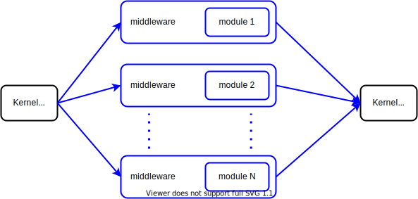

# Gosoline modules

We saw in the previous section, [Kernels](kernel.md), that every Gosoline application involves kernel running one or more modules that have been added to it.



When a kernel starts running, it will launch a goroutine for each module, and each such goroutine runs the middleware configured for that kernel, along with the module itself.

A Gosoline module is any structure implementing the  _Module_ interface:

[embedmd]:# (../../pkg/kernel/module.go /type Module interface/ /\n}/)
```go
type Module interface {
	// Run the module. If the provided context is canceled you have a few seconds (configurable with kernel.killTimeout)
	// until your module is killed (via exit(1)). If you return from Run, it is assumed that your module is done
	// executing and (depending on the type of your module) this might trigger a kernel shutdown.
	// If one of your modules returns an error, the kernel will stop (thus stopping all other modules).
	Run(ctx context.Context) error
}
```

## Module lifecycle

A _Module_ can have one of these three states: _Not started_, _Running_, or _Finished_.

- **Not Started** means that the module has been added to its kernel but the kernel itself has not yet started.
- **Running** is when the Kernel has started, and thus has started all its modules, which are now running.
- **Finished** means that a module has stopped running, either because it finished its work, or because the kernel has stopped it.

The lifecycle of a module is _Not started_ -> _Running_ -> _Finished_. 

There are several rules regarding when a kernel stops, based on the type of modules it is running. A module type is configured when adding it, and the available options are:

- **Essential module:** the kernel runs until the first essential module finishes, then stops and cancels all modules that are still running. It also counts as a foreground module.
- **Foreground module:** unless an essential module finishes first, the kernel will keep running as long as there is at least one foreground module still running.
- **Background module:** modules that get to run as long as no essential module has stopped yet, and there is at least one foreground module still running.
- **Essential background module:** the kernel stops when the first of the next two condition becomes valid: there is no longer any foreground module running, or when this essential background module has finished.

## Usage example:

[embedmd]:# (../../examples/getting_started/module/main.go)
```go
package main

import (
	"context"
	"time"

	"github.com/justtrackio/gosoline/pkg/application"
	"github.com/justtrackio/gosoline/pkg/cfg"
	"github.com/justtrackio/gosoline/pkg/kernel"
	"github.com/justtrackio/gosoline/pkg/log"
)

func main() {
	app := application.Default()
	app.Add("hello-world", NewHelloWorldModule, kernel.ModuleType(kernel.TypeBackground))
	app.Add("foreground-module", NewForegroundModule, kernel.ModuleType(kernel.TypeForeground))
	app.Run()
}

func NewHelloWorldModule(ctx context.Context, config cfg.Config, logger log.Logger) (kernel.Module, error) {
	return &helloWorldModule{
		logger: logger.WithChannel("hello-world"),
	}, nil
}

type helloWorldModule struct {
	logger log.Logger
}

func (h *helloWorldModule) Run(ctx context.Context) error {
	ticker := time.Tick(10 * time.Second)

	select {
	case <-ctx.Done():
		h.logger.Info("Time to stop")
	case <-ticker:
		h.logger.Info("Hello World")
	}

	return nil
}

func NewForegroundModule(ctx context.Context, config cfg.Config, logger log.Logger) (kernel.Module, error) {
	return &foregroundModule{
		logger: logger.WithChannel("foreground-module"),
	}, nil
}

type foregroundModule struct {
	logger log.Logger
}

func (e *foregroundModule) Run(ctx context.Context) error {
	e.logger.Info("Foreground module")

	return nil
}
```

The code above creates a kernel, adds two modules to it, then starts running the kernel. Both modules will log a single line, then end. 

[embedmd]:# (../../examples/getting_started/module/main.go /func main/ /\n}/)
```go
func main() {
	app := application.Default()
	app.Add("hello-world", NewHelloWorldModule, kernel.ModuleType(kernel.TypeBackground))
	app.Add("foreground-module", NewForegroundModule, kernel.ModuleType(kernel.TypeForeground))
	app.Run()
}
```

The _"hello-world"_ module is added as a background module, while the _"foreground-module"_ as a foreground one. This means that when _"foreground-module"_ finishes running, the kernel will realize there are no other foreground modules left and will try to stop the background ones as well.

[embedmd]:# (../../examples/getting_started/module/main.go /func \(h \*helloWorldModule\) Run/ /\n}/)
```go
func (h *helloWorldModule) Run(ctx context.Context) error {
	ticker := time.Tick(10 * time.Second)

	select {
	case <-ctx.Done():
		h.logger.Info("Time to stop")
	case <-ticker:
		h.logger.Info("Hello World")
	}

	return nil
}
```

Module _"hello-world"_ creates a channel that will receive a value every 10 seconds. It will then wait until either _ticker_ or _context.Done_ has a value, and print `"Hello World"` or `"Time to stop"`, respectively.

```
$ go run main.go 

12:53:50.454 kernel  info    stage 0 up and running                              application: application
12:53:50.454 kernel  info    stage 1024 up and running                           application: application
12:53:50.454 kernel  info    stage 2048 up and running                           application: application
12:53:50.454 kernel  info    kernel up and running                               application: application
12:53:50.454 kernel  info    running background module metric in stage 0         application: application
12:53:50.454 metrics info    metrics not enabled..                               application: application
12:53:50.454 kernel  info    running background module hello-world in stage 2048  application: application
12:53:50.454 kernel  info    running foreground module foreground-module in stage 2048  application: application
12:53:50.454 kernel  info    running background module api-health-check in stage 1024  application: application
12:53:50.454 foreground-module info    Foreground module                                   application: application
12:53:50.454 kernel  info    stopped background module metric                    application: application
12:53:50.454 kernel  info    stopped foreground module foreground-module         application: application
12:53:50.454 kernel  info    running background module metadata-server in stage 1024  application: application
12:53:50.454 kernel  info    stopping kernel due to: no more foreground modules in running state  application: application
12:53:50.454 kernel  info    stopping stage 2048                                 application: application
12:53:50.455 hello-world info    Time to stop                                        application: application
12:53:50.455 kernel  info    stopped background module hello-world               application: application
12:53:50.455 kernel  info    stopped stage 2048                                  application: application
12:53:50.455 kernel  info    stopping stage 1024                                 application: application
12:53:50.455 metadata-server info    serving metadata on address [::]:40909              application: application
12:53:50.455 kernel  info    stopped background module api-health-check          application: application
12:53:50.455 kernel  info    stopped background module metadata-server           application: application
12:53:50.455 kernel  info    stopped stage 1024                                  application: application
12:53:50.455 kernel  info    stopping stage 0                                    application: application
12:53:50.455 kernel  info    stopped stage 0                                     application: application
12:53:50.455 kernel  info    leaving kernel                                      application: application
```

When running the code, _"foreground-module"_ gets to complete successfully, then as the kernel has no other foreground modules, _"hello-world"_ will have its `ctx` cancelled, and thus log `Time to stop`.

## Additional features

### Default values
At runtime, every _Module_ object will have to implement the following interfaces:

[embedmd]:# (../../pkg/kernel/module.go /type Module interface/ /\n}/)
```go
type Module interface {
	// Run the module. If the provided context is canceled you have a few seconds (configurable with kernel.killTimeout)
	// until your module is killed (via exit(1)). If you return from Run, it is assumed that your module is done
	// executing and (depending on the type of your module) this might trigger a kernel shutdown.
	// If one of your modules returns an error, the kernel will stop (thus stopping all other modules).
	Run(ctx context.Context) error
}
```

This is the backbone of Gosoline module creation. Each _ModuleFactory_ is a function that returns one such _Module_ object.

[embedmd]:# (../../pkg/kernel/module.go /type TypedModule interface/ /\n}/)
```go
type TypedModule interface {
	IsEssential() bool
	IsBackground() bool
}
```

Internally, a kernel needs to know if a module is a background module, and if it is essential. To configure these properties you need to pass in _Options_ as parameters to `kernel.Add`. The default values, for a module without any specific options, is that this module is a non-essential foreground module. 

[embedmd]:# (../../pkg/kernel/module.go /type StagedModule interface/ /\n}/)
```go
type StagedModule interface {
	GetStage() int
}
```

The stage mechanism is explained below.

[embedmd]:# (../../pkg/kernel/module.go /type FullModule interface/ /\n}/)
```go
type FullModule interface {
	Module
	TypedModule
	StagedModule
}
```

A _FullModule_ needs to implement the other three interfaces.

### Module and stages

The modules added to a kernel are grouped together in stages. They are important to understand the order in which a kernel that wants to shut down will stop its modules:


Gosoline waits for all modules in any given stage to exit, before starting the shutdown of the next stage. The first stage to be stopped is the highest one, stage _K_, then the one before it, _K-1_, and so on until the first stage. This creates a partially defined order in which modules are to be shut down.

Having this order is useful. For example, the metric daemon can collect metrics written by modules when they exit, because `StageApplication` and `StageService` both exit before `StageEssential`, in which the metric daemon is running.

We can configure the stage of a module with an _Option_, similarly to how a module can be configured to an essential or a background module. Alternatively, the stage of a module can also be configured by having the _Module_ object implement the `GetStage` method. If no stage was configured for a module, it will be added to stage `StageApplication`.

## Interesting Config structures

There are a few important configuration structures for modules and kernels:

[structmd]:# (pkg/kernel/module.go ModuleState ModuleConfig)
**ModuleState**

ModuleState stores data needed for module management.

| field       | type     | default     | description     |
| :------------- | :----------: | :----------: | -----------: |
| Factory | ModuleFactory |  | Factory function that will produce this module. |
| Module | Module |  | Module stores the core functionality of this module. |
| Config | ModuleConfig |  | Config information regarding starting and stopping this module. |
| IsRunning | bool |  | IsRunning or not. |
| Err | error |  | Error obtained by running this module. |

**ModuleConfig**

ModuleConfig stores attributes used in starting and stopping a module.

| field       | type     | default     | description     |
| :------------- | :----------: | :----------: | -----------: |
| Essential | bool |  | Essential causes the kernel to stop after its first essential module finishes. |
| Background | bool |  | Background modules run as long as there is at least one foreground module still running. |
| Stage | int |  | Stage in which this module will be started. |

[structmd end]:#

## Wrapping it up

Kernels and modules are the building blocks of Gosoline applications, along with middleware. The next page is about [Middleware](middleware.md).
